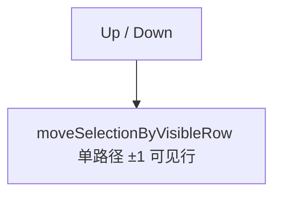

# 书签树操作规格

> **基线**：2026-06-04  
> **范围**：Tool Window 书签树 — [`BookmarkPanel.kt`](../src/main/kotlin/emohce/presentation/toolwindow/panel/BookmarkPanel.kt) 及关联类  
> **状态**：与当前实现一致  
> **附录**（实现补丁摘要）：[260604-cursor-tree-navigation-fix.md](./260604-cursor-tree-navigation-fix.md)

---

## 目录

| § | 内容 |
|---|------|
| [1](#1-目标与非目标) | 目标与非目标 |
| [2](#2-展示模型) | 树结构、懒加载、展开状态、搜索高亮 |
| [3](#3-键盘导航) | 方向键（核心）：拦截机制、←→、↑↓ 对照与算法 |
| [4](#4-鼠标与拖放) | 单击、拖拽、落点语义 |
| [5](#5-工具栏与树内快捷键) | 工具栏 / 右键 / Enter 等 |
| [6](#6-外部联动) | SelectionBus、Gutter |
| [7](#7-导航能力对照) | 树 ↑↓、Alt+↑↓、全局 Prev/Next、Process Intent |
| [8](#8-节点类型) | Group / Process / Bookmark 等 |
| [9](#9-实现映射) | 文件索引 |
| [10](#10-验收) | runIde 清单与单测 |
| [11](#11-演进记录) | 变更历史 |

---

## 1. 目标与非目标

### 1.1 目标

- **非搜索**与**搜索**共用同一套方向键拦截与 **←→** 行为；**↑↓** 按模式分算法，但体验应对齐（能进折叠子树、能 populate 占位）。
- 搜索**只高亮**匹配项，**不过滤**树节点。
- 折叠状态写入 `expandedNodeIds`，搜索期手动折叠不被刷新覆盖。
- 拖拽**按下即可拖**，无需先单击。

### 1.2 非目标

- 不新增独立搜索框（沿用树上 **TreeSpeedSearch**）。
- 不改变 **Alt+↑↓**（兄弟排序，见 [§7](#7-导航能力对照)）。
- 不改变 `.codemark` 格式。
- 本文档主体为**树面板**；Gutter / 全局导航见 [§6](#6-外部联动)、[§7](#7-导航能力对照)。

---

## 2. 展示模型

### 2.1 结构

| 概念 | 说明 |
|------|------|
| invisible root | 模型根，`isRootVisible = false` |
| file root | 多文件时顶层可见节点 |
| 懒加载 | 未展开容器仅 `Loading...` 占位；展开时 `populateChildren` |
| 单 file root | 子节点提升到 invisible root，无 file root 包装层 |
| description 后缀 | Bookmark / Group 名称后展示 description 首个非空行；为空则不展示 |

[`BookmarkTreeModelBuilder.kt`](../src/main/kotlin/emohce/presentation/toolwindow/panel/BookmarkTreeModelBuilder.kt)：

- `shouldExpand = expandedNodeIds.contains(uuid)`（**不因搜索强制全展开**）。
- 搜索**不过滤**：完整树始终在模型中。

### 2.2 高亮与展开

| 项 | 行为 |
|----|------|
| 搜索高亮 | `TreeSpeedSearch` + `BookmarkTreeCellRenderer` / `SpeedSearchUtil` |
| 选中行 | `highlightNodeId` 绿色，与搜索高亮叠加 |
| 持久化 | `ExpandNode` / `CollapseNode` → `expandedNodeIds`；落盘 `.codemark/tree-ui.json`，重启 IDE 后恢复 |
| UI 同步 | `applyExpandedIdsToTree` |
| 首次进入搜索 | 前缀 空→非空：一次性展开**直接匹配项祖先**；后续仅 `repaint`，不重置用户折叠 |

---

## 3. 键盘导航

### 3.1 统一拦截

[`installTreeNavigationKeyDispatcher`](../src/main/kotlin/emohce/presentation/toolwindow/panel/BookmarkPanel.kt) 在下列焦点下**始终**消费 ↑↓←→（非仅搜索期）：

- 树内组件，或树为 focus owner，或与树**同窗口**的 SpeedSearch 弹层（[`isTreeNavigationFocusContext`](../src/main/kotlin/emohce/presentation/toolwindow/panel/BookmarkPanel.kt)）。

| 若未拦截 | 后果 |
|----------|------|
| 非搜索仅靠 `InputMap` | JTree 默认 UI 抢键，`←→` 常失效 |
| 搜索无 Dispatcher | SpeedSearch 默认逻辑关闭弹窗/清高亮 |

**职责分离（禁止混用）**：

| 轴向 | 职责 | 禁止 |
|------|------|------|
| **↑ / ↓** | 仅在**当前可见行**间移动选中 | 不 expand/collapse、不 populate、不「进首子/末子」 |
| **← / →** | 折叠/展开结构；**→** 进入子级（populate + 首子） | 不代替 ↑↓ 在 root 间跳选 |

**路由**：

| 键 | 处理 |
|----|------|
| ← / → | `collapseForNavigation` / `expandForNavigation`（[§3.2](#32-水平导航)） |
| ↑ / ↓ | 非搜索与搜索均：`moveSelectionConsideringLazyLoad`（[§3.3](#33-垂直导航)） |

其余树内键（不变）：**Alt+↑↓** 兄弟排序；**Enter** 激活；搜索期 **ESC** 退出 SpeedSearch。

### 3.2 水平导航（←→，两种模式相同）

实现：[`collapseForNavigation`](../src/main/kotlin/emohce/presentation/toolwindow/panel/util/BookmarkTreeUtil.kt) / [`expandForNavigation`](../src/main/kotlin/emohce/presentation/toolwindow/panel/util/BookmarkTreeUtil.kt)

| 键 | 选中状态 | 行为 |
|----|----------|------|
| ← | **Group 已展开** | 折叠当前 Group，选中不变 |
| ← | **Group 已折叠** | 若有父级 Group/Process：折叠父级（若已展开）并选中父级 |
| ← | **Bookmark / Note** | 折叠父级 Group/Process（若已展开）并选中该父级 |
| ← | **Process 已展开** | 同 Group 已展开 |
| ← | **Process 已折叠** | 同 Group 已折叠 |
| → | 有子（含占位） | `populateChildren`（如需）→ 展开 → **选中第一个真实子节点** |
| → | 已展开且有子 | **仍**进入第一个子节点（IDE 树惯例） |
| → | 叶子 | 无操作 |

- 折叠/展开经 `TreeExpansionListener` 写入 `expandedNodeIds`。
- 搜索期：同上，且**不**关弹窗、**不**清前缀；`TreeSelectionListener` **不**触发 `SelectNode`（不跳编辑器）。

### 3.3 垂直导航（↑↓）

| 模式 | 实现 | 步进规则 |
|------|------|----------|
| **非搜索** | `moveSelectionConsideringLazyLoad` | 见 [§3.4](#34-垂直-updown-算法) |
| **搜索** | 同上 + `searchNavigationStopIds()` | 落点 = `directMatchNodeIds` + **折叠**中的祖先；已展开容器仅作路径不停留，以便从 `2.2` ↓ 到末项 `2.22`；子树全无匹配则 **跳过** |

### 3.4 垂直 ↑↓ 算法（非搜索与搜索共用）

仅可见行移动，实现：[`moveSelectionConsideringLazyLoad`](../src/main/kotlin/emohce/presentation/toolwindow/panel/util/BookmarkTreeUtil.kt)



| # | 规则 | 说明 |
|---|------|------|
| 1 | 可见行 | 只在 `rowCount` 已有行上 ±1；**不**触发懒加载展开 |
| 2 | 多 file root ↓ | 各 root **未展开**时，可见行即 root 列表；`↓` 从 root₁ → root₂（**不**进子级） |
| 3 | 进子级 | 必须用 **→**（`expandForNavigation`）：populate → 展开 → 首子 |
| 4 | 已展开子树 | `moveSelectionByVisibleRow` 每次键仅步进 **1** 个可导航可见行；**含 Group**，不限于 Bookmark |
| 4b | 搜索期 | ↑↓ 仅 `visibleNodeIds`（直接匹配 + 匹配项祖先 + 匹配子树）；无匹配的嵌套 Group **不可**作为步进落点 |
| 5 | ↑ 到折叠组 | 从组下方 `↑` 选中**折叠组行本身**（不展开）；进组内用 **→** |
| 6 | 无下一行 | 单节点折叠且下方无行时 `↓` **保持不动**；实现上不得调用 `scrollPathToVisible`（会 `expandPath` 选中组） |

### 3.5 搜索期其它

| 项 | 行为 |
|----|------|
| 前缀 空↔非空 | 刷新树 / `bootstrapSearchExpansion` |
| 仅字符变化 | 更新 `searchResult` + `repaint` |
| ESC / 清空前缀 | `exitSearchMode`：清 `searchQuery`/高亮/临时展开，强制重建树；↑↓ 恢复 `moveSelectionConsideringLazyLoad` |
| 搜索期 ←→ | 与 non-search 相同（`collapseForNavigation`/`expandForNavigation`），Dispatcher 优先于 SpeedSearch 默认键 |
| 搜索导航自动展开 | bootstrap 与 ↑↓ 定位展开的祖先为**临时**（`searchBootstrapExpandIds`，不持久化）；退出搜索**回收** |
| 搜索期手动展开/折叠 | 经 `treeExpanded`/`treeCollapsed` **持久化**进 `expandedNodeIds`，退出后保留 |

---

## 4. 鼠标与拖放

| 操作 | 行为 |
|------|------|
| 单击节点 | 选中；非搜索 → 跳转编辑器 |
| 单击空白 | 聚焦树（SpeedSearch 输入） |
| 双击组图标 / 行 | 折叠切换（图标 500ms 防冲突） |
| 拖拽 | `exportAsDrag` 按坐标选中并聚焦，**无需先单击** |

**落点**（[`BookmarkTreeDropSupport`](../src/main/kotlin/emohce/presentation/toolwindow/panel/BookmarkTreeDropSupport.kt)）：上 38% BEFORE、下 38% AFTER、中间 INTO（仅 Group/Process）；不可拖入 `SUPER_ROOT` 或自身后代。

---

## 5. 工具栏与树内快捷键

[`BookmarkTreeActions.kt`](../src/main/kotlin/emohce/presentation/toolwindow/panel/BookmarkTreeActions.kt)

| 入口 | 功能 |
|------|------|
| 刷新 / 收缩全部 / 定位当前 | Refresh；折叠全部并清空 `expandedNodeIds`；展开到 `lastSelectedNodeId` |
| 新建 / 编辑 / 删除 | Group、Bookmark、Note 等 Intent |
| Alt+↑↓ | 兄弟排序（[§7](#7-导航能力对照)） |
| Enter | 激活选中 |
| 右键菜单 | **书签/笔记**：上一个书签、下一个书签、编辑、移动（全中文）；**组/流程等**：新建组、编辑、移动、删除、导航、刷新、定位当前；Group 时「展开所有嵌套子项」。右键弹出前与 ↑↓ 同步选中（不跳编辑器） |
| 移动 | 树形弹窗 `BookmarkMoveTreePopup`：↑↓ 选行、←→ 前/内/后，Enter/确定；默认书签在选定节点之后、组在父容器内末尾 |
| F1 详情 | `ShowCodemarkDetailsAction`：树焦点/SpeedSearch 同窗口时展示悬停节点详情，悬停为空则展示选中节点详情；新弹窗打开前关闭旧弹窗 |

### 5.1 详情弹窗

| 项 | 行为 |
|----|------|
| 触发 | 默认 `F1`，Action 可在 IDE Keymap 中改绑 |
| 选点 | hover path 优先，其次 selection path |
| 搜索态 | SpeedSearch 输入期间同样可触发，不关闭搜索前缀 |
| 内容 | 节点类型、引用标记、项目相对文件位置、完整 description |
| Markdown | description 渲染为 Markdown；普通换行保留为换行 |
| 链接 | 项目相对路径基于 project root 解析；支持 `path`、`path:line`、`path:line:column`、`path#Lline` |
| 导航 | 相对链接打开 IDE 文件并跳转行列；`http`/`https` 使用浏览器 |

---

## 6. 外部联动

### 6.1 SelectionBus

| 字段 | 用途 |
|------|------|
| `lastSelectedNodeId` | 定位当前、默认父级、全局导航 |
| `currentContainerId` | 当前容器 |
| `requests` | Gutter 等请求选中 → `selectNodeById` 或 `expandToNodeByDomainPath` |

深节点须能沿域路径 populate 并选中（与 [§3](#3-键盘导航) 懒加载规则共用）。

### 6.2 Gutter

[`BookmarkHighlighterService`](../src/main/kotlin/emohce/presentation/editor/highlighter/BookmarkHighlighterService.kt)：左键 → `requestSelect`；右键含 Edit / Add After / 全局 Prev/Next / Delete。

---

## 7. 导航能力对照

| 能力 | 触发 | 范围 | 改结构 |
|------|------|------|--------|
| 树 ↑↓ | 树焦点 / SpeedSearch 同窗口 | 可见行或匹配前序 | 否 |
| 树 ←→ | 同上 | 折叠/展开/进首子 | 仅 `expandedNodeIds` |
| **Alt+↑↓** | 树快捷键 | **同级兄弟** index | **是**（`MoveNode`） |
| **全局 Prev/Next** | 菜单、Gutter、plugin **Alt+Shift+↑/↓** | 全树可导航书签 | 否 |
| **Process 内 Prev/Next** | Intent 已实现 | 当前 Process 内链 | 否；**尚无**树快捷键绑定 |

> **注意**：Alt+↑↓ **不是** Process 内导航。与 [260206-操作入口与快捷键汇总.md](archive/260206-操作入口与快捷键汇总.md) 中「流程内上一项」描述不一致时，**以本文档与代码为准**。

---

## 8. 节点类型

| 类型 | 子节点 | 懒加载 | 非搜索选中 |
|------|--------|--------|------------|
| Group | `children` | 是 | `SelectNode` → 容器上下文 |
| Process | `steps` | 是 | 同上；入口 `entryFilePath` / `entryLine` |
| Bookmark / Descriptive | 叶子 | 否 | 跳转文件行 |
| file root | 多文件顶层 Group | 是 | 容器 |

---

## 9. 实现映射

| 域 | 文件 |
|----|------|
| 模型 | `BookmarkTreeModelBuilder.kt` |
| 键盘 | `BookmarkTreeUtil.kt`（`moveSelectionConsideringLazyLoad`、`expandForNavigation`）、`BookmarkPanel.installTreeNavigationKeyDispatcher` |
| 搜索 | `onSpeedSearchPrefixChanged`、`bootstrapSearchExpansion`、`BookmarkIndexService` |
| 展开状态 | `BookmarkViewModel`、`applyExpandedIdsToTree` |
| 拖拽 | `BookmarkTreeDnDHandler.kt`、`BookmarkTreeDropSupport.kt` |
| 渲染 | `BookmarkTreeCellRenderer.kt` |
| 详情弹窗 | `ShowCodemarkDetailsAction.kt`、`BookmarkPanel.showCurrentNodeDetails` |
| 外部选中 | `SelectionBus`、`expandToNodeByDomainPath` |
| 全局导航 | `GlobalCodemarkNavigationUseCase`、`CodemarkNavigationHelper` |

---

## 10. 验收

### 10.1 runIde

**非搜索**

- [ ] 多 file root 未展开：`↓` root₁→root₂，`↑` 回 root₁；不因 `↓` 展开
- [ ] 上述场景下 `→` 展开并进首子，`←` 折叠；再 `↓` 仍可跳到 root₂（职责不混用）
- [ ] `New Group`（已展开 root 内）`↓` 可到 `CodeMarks`，不误展开占位组
- [ ] 折叠组下方 `↑` 选中折叠组行（不展开）；进组内用 `→`
- [ ] 单行折叠节点 `↓` 不动；`→` 才展开
- [ ] `←→` 与搜索期一致；`↑↓` 不触发 expand/collapse
- [ ] 单击/Enter 跳转；拖拽无需先单击
- [ ] 展开某组后点击组内书签：跳转编辑器且**整棵树保持原样**（不全量收缩）

**搜索**

- [ ] 全树仍在，仅字符高亮
- [ ] 首次输入展开匹配祖先
- [ ] ↑↓ 仅停在搜索相关节点（组名匹配 / 含匹配子项的折叠组）；全无匹配的组被跳过
- [ ] ←→ 保持前缀与高亮；不跳编辑器
- [ ] 搜索期折叠后改前缀仍保持折叠
- [ ] ESC 后展开状态与非搜索共用
- [ ] 搜索 ↑↓ 定位展开的祖先在退出搜索后**回收**；搜索期手动展开/折叠退出后**保留**
- [ ] 搜索期按 `F1` 可展示当前悬停/选中节点详情，不清搜索前缀

**联动与回归**

- [ ] Gutter 深节点展开选中, 不能自动折叠
- [ ] tree鼠标左键点击书签节点, 自动打开editor对应位置
- [ ] Bookmark/Group 节点后缀展示 description 首个非空行；description 多行内容在详情弹窗中保持换行
- [ ] 详情弹窗同一时间仅存在一个；相对 Markdown 链接能按项目根目录跳转文件和行号
- [ ] 全局 Prev/Next、Alt+↑↓（仅排序）、DnD、右键、工具栏

### 10.2 自动化

```bash
./gradlew test
```

| 用例（`BookmarkTreeUtilTest`） | 覆盖 |
|-------------------------------|------|
| `lazy load move down from collapsed top level root jumps to next file root` | §3.4 #2 |
| `multi file root down up and right expand stay separated` | §3 职责分离 |
| `lazy load move down does not expand single collapsed root` | §3.4 #6 |
| `lazy load move down from nested group goes to next visible row not into placeholder` | §3.4 #4 |
| `lazy load move up selects collapsed group row without expanding` | §3.4 #5 |
| `expand for navigation populates placeholder and selects first child` | §3.2 → |

---

## 11. 演进记录

| 日期 | 摘要 |
|------|------|
| 2026-06-04 | 初版：懒加载、搜索高亮不过滤、DnD、`expandedNodeIds` 搜索期持久化 |
| 2026-06-04 | 搜索 ↑↓：`directMatchNodeIds` 前序 + `expandToNodeByDomainPath` |
| 2026-06-04 | 非搜索 ↑↓←→：常驻 `installTreeNavigationKeyDispatcher`；`moveSelectionConsideringLazyLoad`；`expandForNavigation` |
| 2026-06-04 | 多 file root：`↓` 仅可见行跳 root；进子级/展开仅 `→`；`↑↓` 移除 expand/populate 逻辑 |
| 2026-06-04 | 补充：节点类型、落点、SelectionBus、Gutter、导航语义对照、右键菜单 |
| 2026-06-04 | 展开状态保持：选中/导航不重建树（`transientOnly`）；`isApplyingExpansion` 守卫防 intent 回灌；Gutter `persistAncestorExpansion`；搜索导航展开改临时、退出回收 |
| 2026-06-04 | 差异化刷新 `TreeRefreshKind`：SKIP/DIFF/FULL；拖拽等用 DIFF+applyDiff，避免每次 setRoot 与全量 `applyExpandedIdsToTree` |
| 2026-06-04 | 搜索/非搜索 ↑↓ 统一 `moveSelectionConsideringLazyLoad`；搜索期用 `visibleNodeIds` 过滤落点 |
| 2026-06-04 | 展开状态持久化：`.codemark/tree-ui.json`（`BookmarkTreeUiDataSource`），重启恢复 |
| 2026-06-04 | Group 右键「展开所有嵌套子项」：`collectNestedContainerIds` + `ExpandNodes` |
| 2026-06-04 | 右键同步 ↑↓ 选中；书签精简中文菜单；移动改为树形弹窗 |
| 2026-06-05 | 搜索高亮一致性：`BookmarkIndexService.matchingNodeIdsForSearch` 改为基于 `name` 匹配，与 TreeSpeedSearch 高亮逻辑一致；`searchNavigationStopIds` 优先添加所有直接匹配节点；`isVerticalNavigationRow` 允许未展开 group 作为导航目标 |
| 2026-06-05 | Tree-view 增加 Bookmark/Group description 首行后缀；`F1` 详情弹窗支持搜索态、Markdown 渲染、项目相对链接跳转与单例弹窗 |

---

## 12. 相关文档

| 文档 | 说明 |
|------|------|
| [260604-cursor-tree-navigation-fix.md](./260604-cursor-tree-navigation-fix.md) | 补丁级变更摘要（不重复验收） |
| [260206-操作入口与快捷键汇总.md](archive/260206-操作入口与快捷键汇总.md) | 全插件入口；树搜索/Alt+↑↓ 以本文档为准 |
| [plugin.xml](../src/main/resources/META-INF/plugin.xml) | 全局 Action 默认键 |
